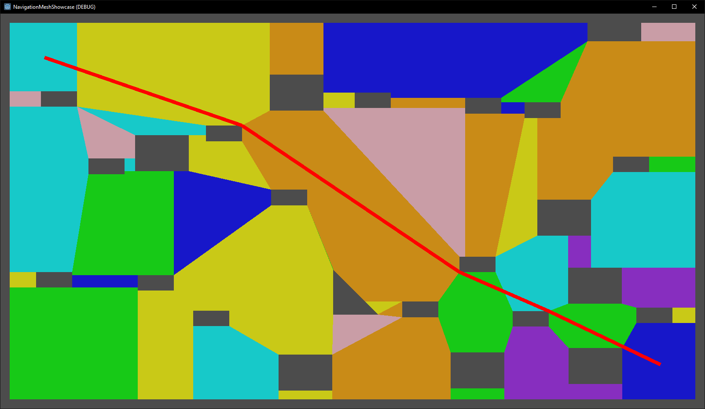
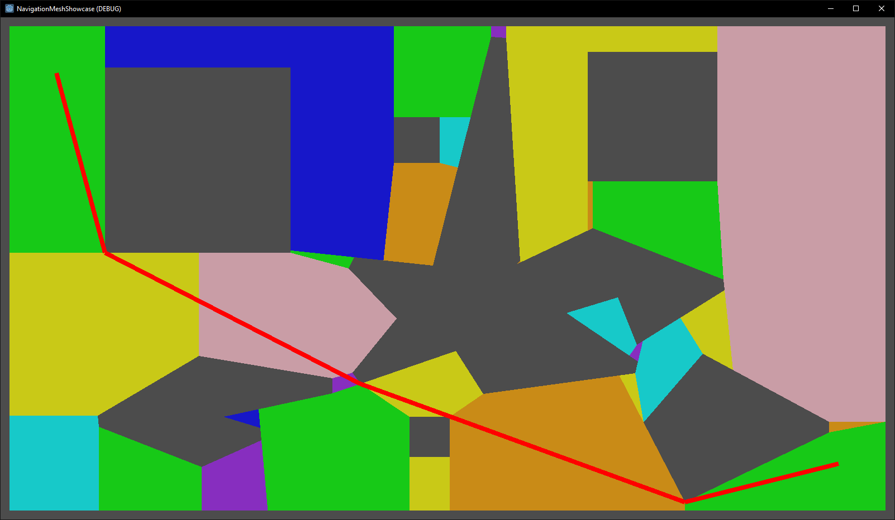

# NavigationMesh
A C# navigation library allowing for fast navigation in 2D space.




Features
--------------------
- Navigation based on run-time generated mesh.
- Adjustment to agent size.
- Works for convex and concave shapes.

Installation
--------------------
This library is available as a NuGet package [here](https://www.nuget.org/packages/Pikol93.NavigationMesh/).

Usage
--------------------
The usage is located in the [NavigationMeshShowcase](https://github.com/pikol93/NavigationMeshShowcase) repo's README file along with an example project created in the Godot Engine.

Performance
--------------------
Notes regarding the benchmark:
- The benchmark was executed with a dataset that is available in JSON format [here](./doc/BenchmarkData.json). The graphical representation of the generated mesh and path can be found [here](./doc/BenchmarkData.png).
- There has been no conversion between any external type and `System.Numerics.Vector2`. This should be taken into consideration when applicating to a real project.
```
BenchmarkDotNet=v0.12.1, OS=Windows 10.0.19041.804 (2004/?/20H1)
Intel Core i5-7400 CPU 3.00GHz (Kaby Lake), 1 CPU, 4 logical and 4 physical cores
.NET Core SDK=3.1.402
  [Host]     : .NET Core 3.1.8 (CoreCLR 4.700.20.41105, CoreFX 4.700.20.41903), X64 RyuJIT
  DefaultJob : .NET Core 3.1.8 (CoreCLR 4.700.20.41105, CoreFX 4.700.20.41903), X64 RyuJIT


|     Method |         Mean |      Error |     StdDev |    Gen 0 | Gen 1 | Gen 2 | Allocated |
|----------- |-------------:|-----------:|-----------:|---------:|------:|------:|----------:|
| CreatePath |     9.774 us |  0.0293 us |  0.0260 us |   3.7537 |     - |     - |  11.51 KB |
| CreateMesh | 2,388.187 us | 14.5723 us | 13.6309 us | 238.2813 |     - |     - | 729.93 KB |
```

Known issues
--------------------
- The library uses `System.Numerics.Vector2` type internally. This means that if the user already utilizes another type for storing two-dimensional point data, a conversion between said type and `System.Numerics.Vector2` type has to take place. This is generally solved by creating a helper class as described in the [example project](https://github.com/pikol93/NavigationMeshShowcase).
- Due to a bug related to inflating the polygons, the agent size is required to be equal or greater than 1.
- Because of the way the [ClipperLib](http://www.angusj.com/delphi/clipper.php) library works, closely packed points can lead to precission errors and invalid polygon data which in effect corrupts the whole mesh. This can handled by managing the data to not contain multiple points that are of distance less than 1 unit. Generally this issue is not critical as the navigation under some cases proved to be working, but it's not recommended to keep a lot of points of an obstacle polygon closely together.
- The created mesh is only accurate to a certain degree. Multiple cases have been found where a path created manually by a human was more optimal than the one created by the algorithm. It is suspected that polygons that have edges of similiar lengths to be more precise.

License
--------------------
This work is licensed under the MIT license. See the [LICENSE file](./LICENSE) for more information.
